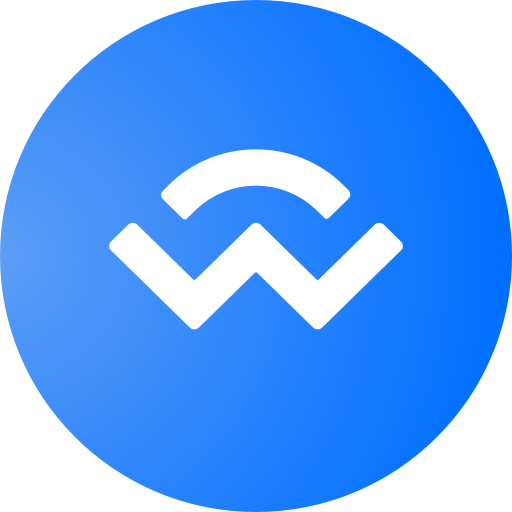

# Get started

Welcome! If you want to use Eternal but do not know how to, you have come to the right place.     To start using Eternal's services there are **only three requirements:**

## 1. Get a valid wallet

You will need a crypto wallet to connect to the Eternal dApp. Currently, we support:

[MetaMask](https://metamask.io)&#x20;

[Coinbase Wallet](https://www.coinbase.com/wallet) &#x20;

[Any wallet supported by WalletConnect](https://walletconnect.com/registry/wallets)

## 2. Add the Avalanche Network

Eternal begins its operations on the Avalanche Network. If you are a MetaMask user, [a tutorial for adding the Avalanche Network to your wallet](https://support.avax.network/en/articles/4626956-how-do-i-set-up-metamask-on-avalanche) is available. For other wallets, the required information is available down below:

* **Network Name**: Avalanche Network
* **New RPC URL**: [https://api.avax.network/ext/bc/C/rpc](https://api.avax.network/ext/bc/C/rpc)
* **ChainID**: 43114
* **Symbol**: AVAX
* **Explorer**: [https://snowtrace.io/](https://snowtrace.io)

## 3. Fund your wallet

Ensure you have some AVAX to pay for transaction fees and a currency which can be used as a deposit in a gage. Currently, the following currencies are supported:

**** **Avalanche (AVAX)**

 **Magic Internet Money (MIM)**

****

<mark style="color:purple;">**You're ready! Now you can move on to**</mark> [**the next tutorial.**](use-the-platform.md)****
