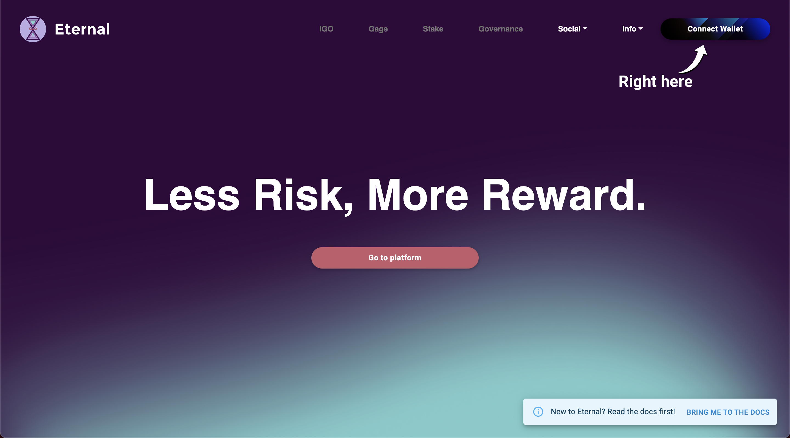

# Unstake ETRNL/Claim rewards

<mark style="color:purple;">Unstaking your ETRNL allows you to claim rewards associated with the amount being unstaked. If you are following this tutorial, ensure you have</mark> [<mark style="color:purple;">staked some ETRNL beforehand</mark>](stake-your-etrnl.md)<mark style="color:purple;">. without further ado, you can do so following these simple steps:</mark>

## 1. Go to the Staking page

Start by navigating to the staking page. You can do so by clicking on the 'Stake' button at the top of the page, on the navigation bar.

## 2. Toggle the slider switch

Click on the slider. It should switch to the 'Unstake' mode.

## 3. Enter an amount

In the input bar, enter the amount of ETRNL you wish to unstake.

## 4. Press Confirm

Finally, press the 'Confirm' button and confirm the transaction.

Once the transaction completes, your stats, visible on the left hand side of the screen, should update accordingly.

Congratulations, you have unstaked your ETRNL and claimed your rewards! The rewards are sent together with the ETRNL you unstaked.
