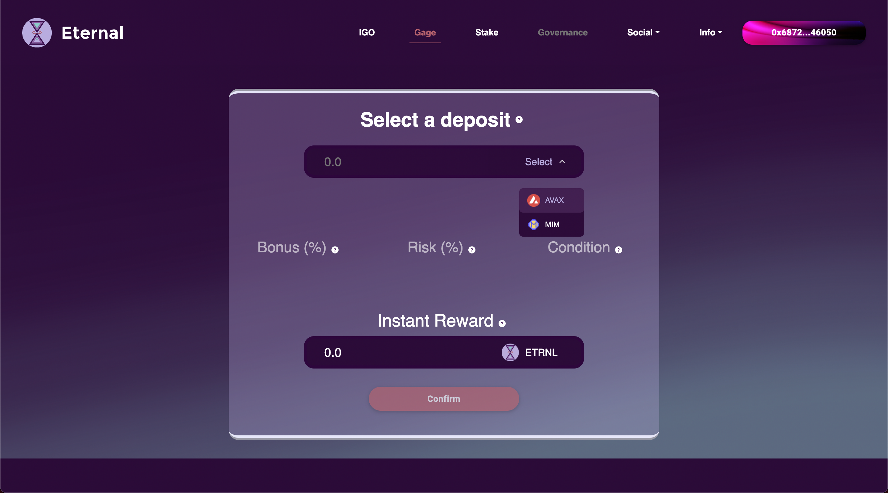

# Use the platform


If you have not already, make sure you are [properly setup](get-started.md) to start using the Eternal dApp. Otherwise, keep reading!


<mark style="color:purple;">Eternal provides you with the easiest and fastest way to earn money, taking</mark> <mark style="color:purple;"></mark><mark style="color:purple;">**only three steps.**</mark>      <mark style="color:purple;"></mark><mark style="color:purple;">We will walk you through every little bit of it.</mark>

## 1. Connect your wallet

[Open our website](https://eternal.money) and click the 'Connect Wallet' button on the top right corner of your screen.

Select a wallet from the given options.

The button will display your address and change color once you successfully connect. Proceed either by clicking the Gage' button on the navigation bar or the 'Go to platform' button in the middle of the screen.

## 2. Select a gage

Try not to be overwhelmed by the amount of choice, and then select one.

## 3. Enter the gage

Gaging offers a different experience depending on the gage in question. Tutorials for each different gage and their procedures can be found below:



Click on the 'Select' button to display a list of assets which can be used as deposits.

Select an asset to deposit. In this example we select AVAX.&#x20;



