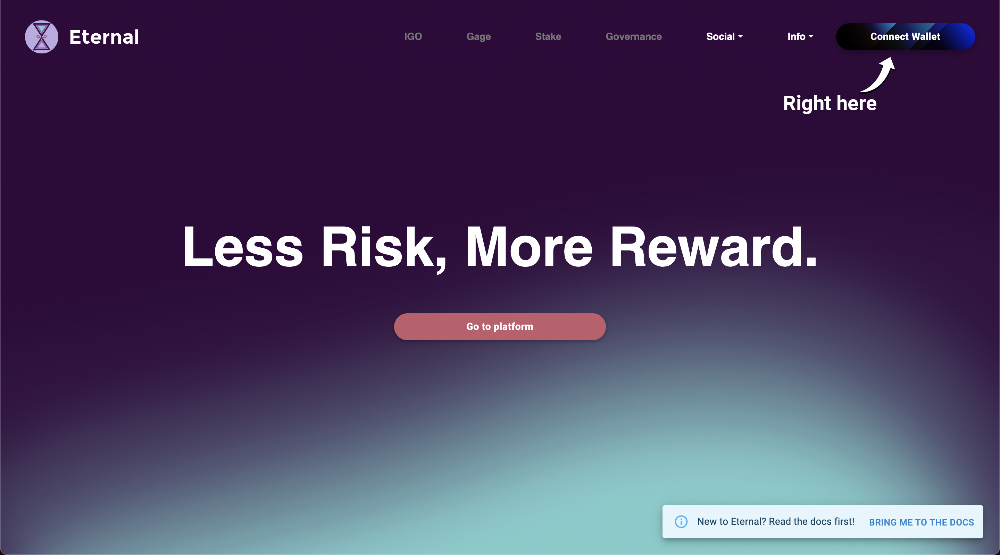
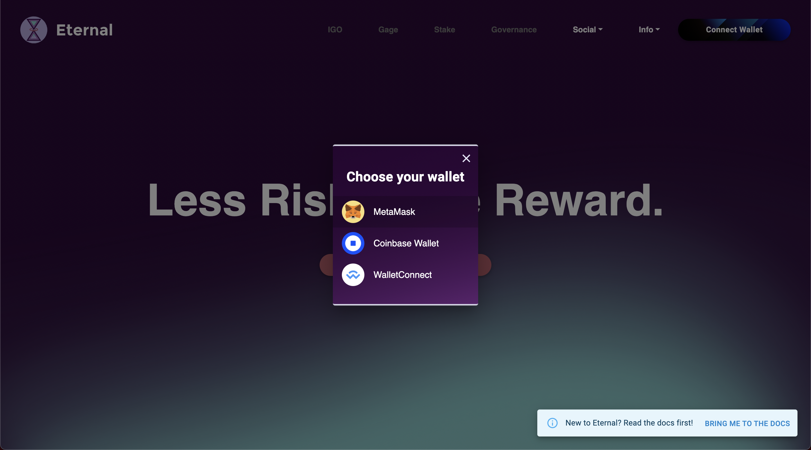
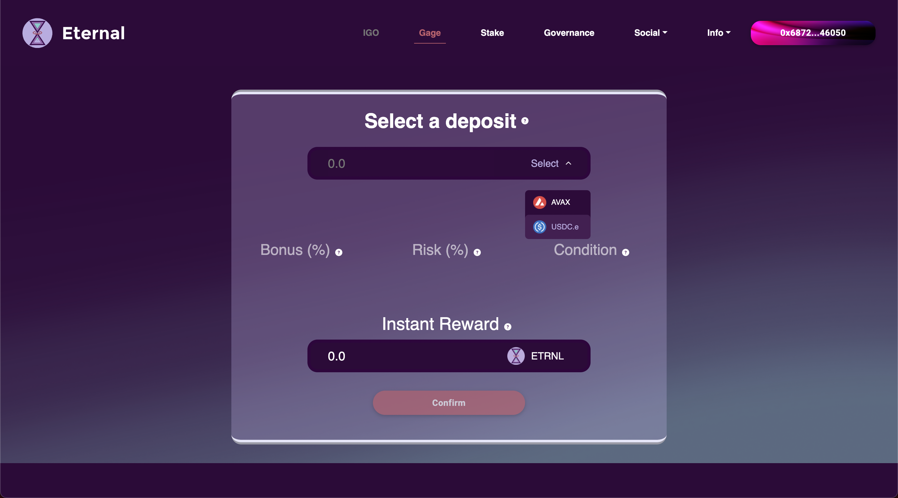
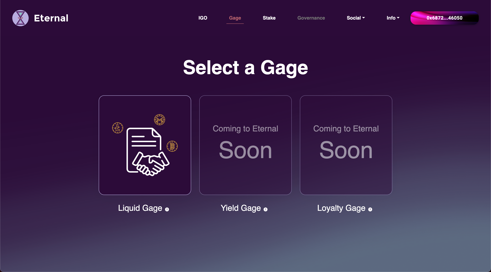
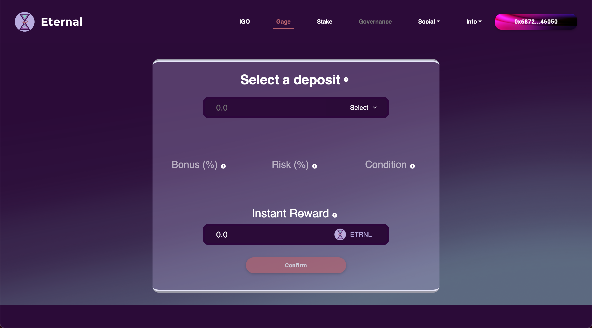

# Use the platform


If you have not already, make sure you are [properly setup](get-started.md) to start using the Eternal dApp. Otherwise, keep reading!


<mark style="color:purple;">Eternal provides you with the easiest and fastest way to earn money, taking</mark> <mark style="color:purple;"></mark><mark style="color:purple;">**only three steps.**</mark>

<mark style="color:purple;">We will walk you through every little bit of it.</mark>

## 1. Connect your wallet

[Open our website](https://eternal.money) and click the 'Connect Wallet' button on the top right corner of your screen.

Select a wallet from the given options.

The button will display your address and change color once you successfully connect. Proceed either by clicking the Gage' button on the navigation bar or the 'Go to platform' button in the middle of the screen.

## 2. Select a gage

Try not to be overwhelmed by the amount of choice, and then select one.

## 3. Enter the gage

Gaging offers a different experience depending on the gage in question. Tutorials for each different gage and their procedures can be found below:



Click on the 'Select' button to display a list of assets which can be used as deposits.

Select an asset to deposit. In this example we select MIM.&#x20;

Once you have selected a deposit, type the amount you wish to deposit  in the top bar. The bottom bar will display the instant bonus you will receive upon entering the gage. The percentage values of the bonus, risk and gage condition will be displayed on the middle of the screen.

If this is your first time entering a gage with this deposit, you will likely need to approve the Eternal Factory to allow it to transfer your funds to the Treasury. Press the 'Approve' button.

Once you have approved, you may enter the gage. Press the 'Confirm' button.

Your wallet will once again prompt you to confirm a transaction.

If everything went correctly, after a few seconds the platform will redirect you to the User Info page.

Congratulations! If you followed these steps you should see a similar screen displaying your gage's stats. We explain the meaning of these stats [here](view-your-stats.md).


